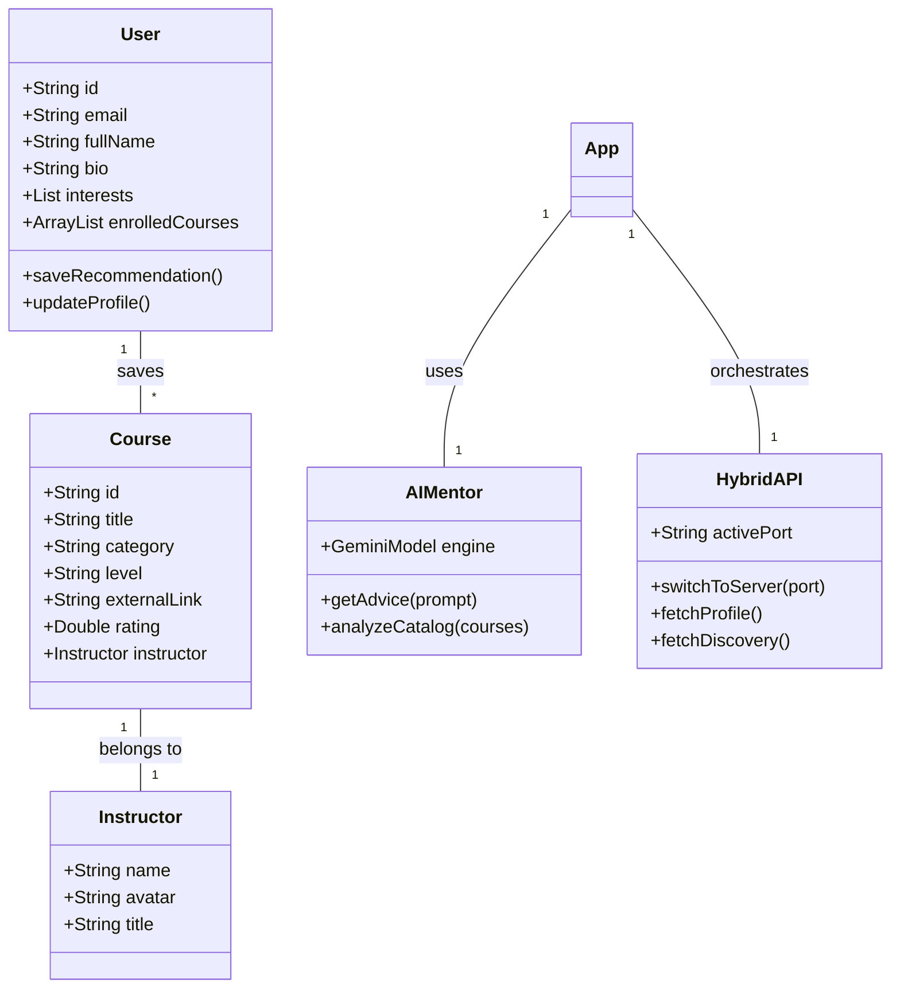
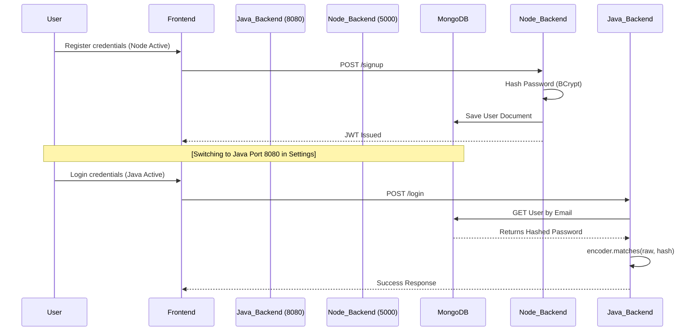
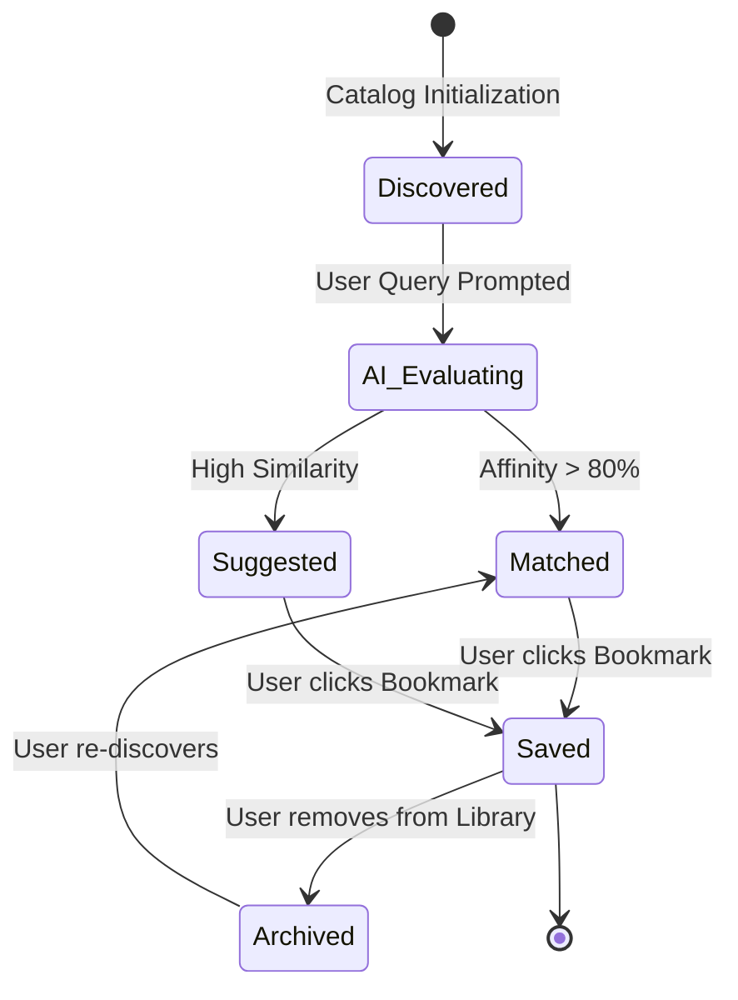
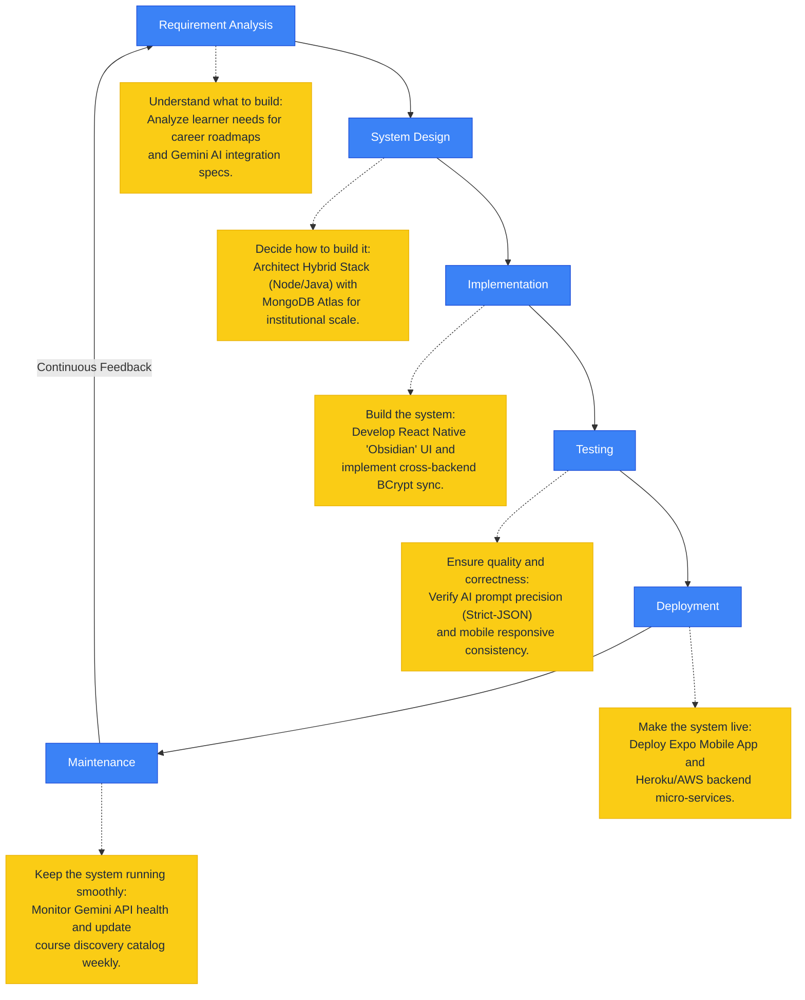

# EduLearn Platform System Diagrams

This document contains the core architectural diagrams for the AI Course Recommendation System.

---

## 5.1 Use Case Diagram
The Use Case diagram illustrates how the User (Learner) and Admin (System) interact with the various functional modules of the platform.

```mermaid
useCaseDiagram
    actor "Learner (User)" as U
    actor "System / Admin" as A
    
    package "Core Platform" {
        usecase "Authenticate (BCrypt Login/Signup)" as UC1
        usecase "Ask AI Mentor for Advice" as UC2
        usecase "Discover Global Courses" as UC3
        usecase "Save Recommendation to Library" as UC4
        usecase "Switch Backend Stack (Node/Java)" as UC5
        usecase "Update Career Bio & Interests" as UC6
    }
    
    U --> UC1
    U --> UC2
    U --> UC3
    U --> UC4
    U --> UC6
    
    A --> UC1
    A --> UC3
    A --> UC5
```

---

## 5.2 Class Diagram
The Class diagram outlines the data structure and relationship between the Core Models and Controllers across the Hybrid Architecture.



---

## 5.3 Activity Diagram
This diagram shows the logical flow of a user seeking a tailored recommendation from the AI Mentor.

```mermaid
activityDiagram
    start
    :User enters career goal in AI Chat;
    :App gathers active Courses from MongoDB;
    :App sends prompt + metadata to Gemini;
    if (Gemini finds match?) then (yes)
        :Gemini returns structured curriculum;
        :App highlights matching from Database;
        :User views Discovery path;
        :User clicks "Add to Library";
        :Sync update to MongoDB (User.enrolled);
    else (no)
        :Gemini provides general guidance;
    endif
    stop
```

---

## 5.4 Sequence Diagram
The following represents the "BCrypt Handshake" flow across a Node.js-to-Java migration.



---

## 5.5 State Diagram
The State diagram represents the "Discovery Lifecycle" of a course recommendation.



---

## 5.6 Network Planning Model (SDLC Cycle)
This diagram illustrates the software development lifecycle specifically tailored for the **EduLearn AI** project, mapping core phases to project-specific milestones.


