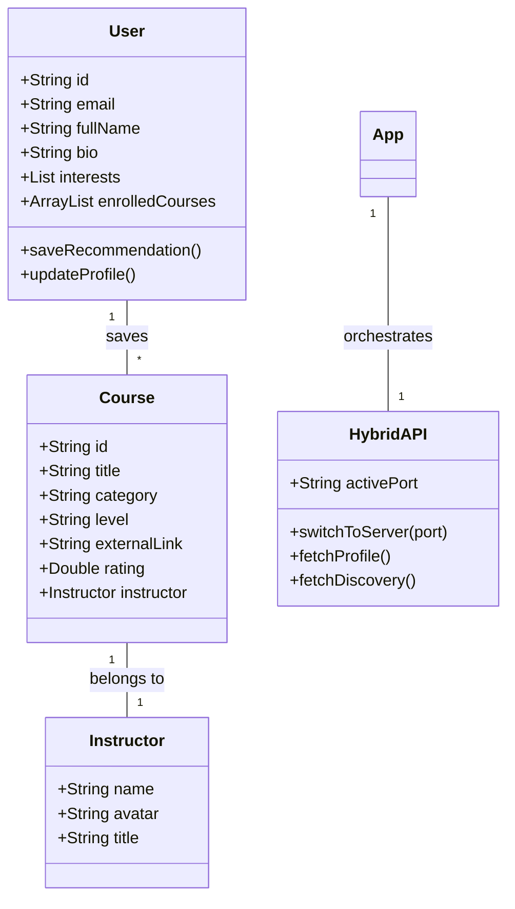
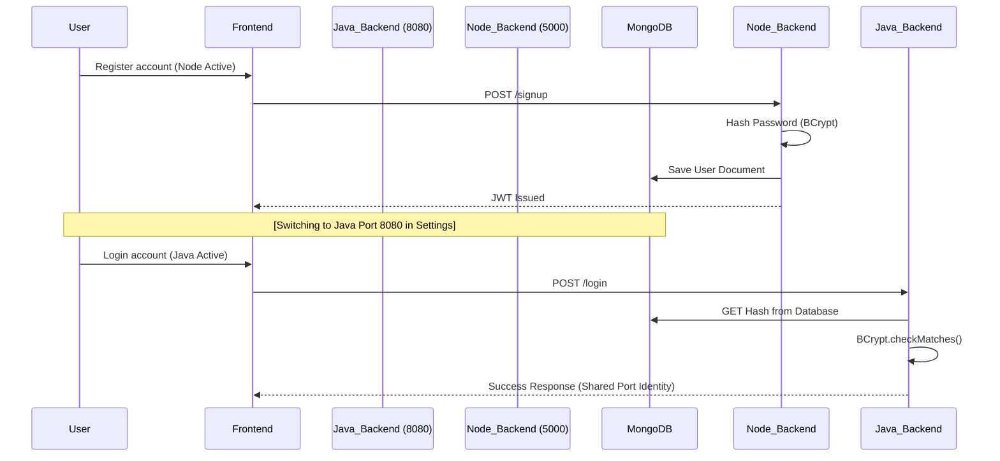
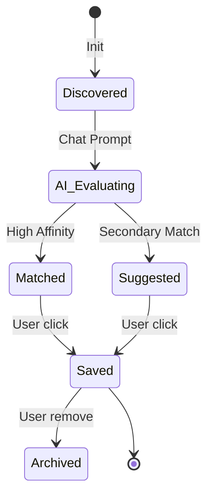

# Project Report: EduLearn AI-Powered Course Recommendation System

---

## 1. ABSTRACT
The **EduLearn AI-Powered Course Recommendation System** is a state-of-the-art educational discovery platform designed to bridge the gap between learners and high-quality external content. Unlike traditional LMS platforms, EduLearn focuses exclusively on **intelligent curation**, utilizing the Gemini 1.5 Flash AI model to match user career goals with the best courses across platforms like Coursera, YouTube, and Udemy. 

The system features a premium "Obsidian" UI built with **React Native (Expo)**, ensuring a seamless experience across Web and Mobile. It utilizes a **Hybrid Backend Architecture** (Node.js & Java Spring Boot) connected to a shared **MongoDB** instance, demonstrating high-performance API orchestration and interoperability. This project solves the problem of "information overload" in online learning by providing personalized, verified, and bookmarkable recommendation paths.

---

## 2. INTRODUCTION

### 2.1. Project Overview & Problem Statement
With the explosion of online education, students often struggle to find the right starting point among millions of available courses. Information is scattered, and platforms often prioritize internal sales over student-centric matching. 

**Problem Statement:** Learners face "choice paralysis" and often waste time on low-quality content. There is a need for a centralized, AI-driven engine that understands a user's unique professional background and recommends a specific "Mastery Path" without the distraction of marketplace pricing or internal enrollment barriers.

### 2.2. Objectives
1.  **AI-Driven Personalization**: Use Large Language Models (Gemini) to provide conversational and data-driven course recommendations.
2.  **Hybrid Interoperability**: Build a system that can switch between Node.js and Java backends in real-time, accessing a shared MongoDB document store.
3.  **Cross-Platform Elite UI**: Implement a premium, dark-themed "Obsidian" design system using React Native for Web and Mobile.
4.  **Content Discovery Engine**: Shift the learning paradigm from "purchasing" to "discovering," highlighting external sources (YouTube/Coursera) as the primary content providers.
5.  **Scalable Data Handling**: Ensure secure user profile management, session persistence, and career-interest mapping.

---

## 3. SYSTEM REQUIREMENTS

### 3.1. Functional Requirements
1.  **Session-Aware Authentication**: Secure Login/Signup with persistent session tokens.
2.  **AI Mentorship Chat**: Real-time conversational AI assisting users in finding career paths.
3.  **Discovery Catalog**: Searchable and filterable database of curated professional courses.
4.  **Matched Library**: Ability for users to "Save" or "Bookmark" recommendations to their profile.
5.  **Hybrid Server Switching**: A developer-centric toggle to switch the platform's API source between Node.js and Java.
6.  **External Redirection**: Direct routing to original content sources (e.g., YouTube video links).

### 3.2. Non-Functional Requirements
1.  **High-Fidelity UI**: Premium "Obsidian" aesthetic with glassmorphism and high-contrast typography.
2.  **Fast API Response**: Optimized MongoDB queries and efficient Hybrid-API switching logic.
3.  **Data Consistency**: BCrypt hashed password matches across both Node.js and Java servers.
4.  **Responsiveness**: Fully adaptive layout for mobile devices and high-resolution web monitors.

---

## 4. TOOLS AND TECHNOLOGIES

### 4.1. Frontend
*   **React Native / Expo**: Cross-platform framework for a single codebase across Web, iOS, and Android.
*   **Expo Router**: File-based routing for a modern SPA (Single Page App) experience.
*   **Ionicons**: Specialized vector iconography for a premium feel.

### 4.2. Backend (Hybrid)
*   **Node.js (Express)**: Fast, asynchronous REST API for rapid discovery and chat orchestration.
*   **Java (Spring Boot)**: Robust, type-safe enterprise-grade backend for profile and data management.
*   **BCrypt**: Unified password hashing algorithm shared between both stacks.

### 4.3. Database
*   **MongoDB**: NoSQL document store for flexible course schemas and high-performance user profile lookups.

### 4.4. AI Core
*   **Gemini 1.5 Flash**: Google's high-speed LLM used for analyzing user interests and providing curriculum advice.

---

## 5. DESIGN PATTERNS

1.  **Hybrid Adapter Pattern**: The frontend utilizes a centralized API utility that adapts requests to either the Node.js or Java port based on the active selection.
2.  **Observer Pattern (Context API)**: React Context is used to observe authentication states (Login/Logout) and update the UI globally.
3.  **Repository Pattern**: Applied in the Java backend using `MongoRepository` to decouple data access logic from business controllers.
4.  **Singleton Pattern**: The Axios instance and Gemini configuration are managed as singletons to ensure efficient resource usage.
5.  **Composition Pattern**: The UI is built using modular, reusable components (Navbar, CourseCard, ActionPill) following atomic design principles.

---

## 5. SYSTEM DESIGN (OOAD)

### 5.1. Use Case Diagram
The Use Case diagram illustrates the core functional boundaries where the Learner interacts with the discovery and AI engines.

```mermaid
useCaseDiagram
    actor "Learner (User)" as U
    actor "System / Admin" as A
    
    package "EduLearn Platform" {
        usecase "Authenticate (BCrypt Sync)" as UC1
        usecase "Ask AI Mentor for Advice" as UC2
        usecase "Discover Global Courses" as UC3
        usecase "Save Recommendation" as UC4
        usecase "Switch Backend (Node/Java)" as UC5
        usecase "Update Career Bio" as UC6
    }
    
    U --> UC1
    U --> UC2
    U --> UC3
    U --> UC4
    U --> UC6
    
    A --> UC1
    A --> UC3
    A --> UC5
```

### 5.2. Class Diagram
The Class diagram documents the unified documentation of User and Course domains across the Hybrid Backend.



### 5.3. Activity Diagram
This diagram outlines the logical decision-making process within the AI Mentorship module.

```mermaid
activityDiagram
    start
    :User enters career goal in AI Chat;
    :App gathers Discovery Courses from MongoDB;
    :App sends prompt + metadata to Gemini;
    if (Gemini finds direct match?) then (yes)
        :Gemini returns tailored curriculum;
        :App highlights matching Courses;
        :User views Discovery path;
        :User clicks "Save to Library";
        :Background sync to MongoDB;
    else (no)
        :Gemini provides general path;
    endif
    stop
```

### 5.4. Sequence Diagram
Documents the unified BCrypt login authentication handshake between servers.



### 5.5. State Diagram
Illustrates the lifecycle of a Course Recommendation within the user experience.



---

## 7. SOFTWARE TESTING

### 7.1. Testing Types
*   **Unit Testing**: Isolated testing of React components (Navbar, Button) and Backend services.
*   **Parity Testing**: Verifying that the same frontend action (e.g., Change Name) produces the same update on both Node.js and Java servers.
*   **E2E (End-to-End)**: Validating the full flow from Sign-up -> AI Chat -> Bookmark -> Profile View.

### 7.2. Sample Test Cases

| Test ID | Module | Description | Expected Result | Status |
| :--- | :--- | :--- | :--- | :--- |
| TC01 | Auth | Login with BCrypt (Node -> Java) | Successful Login on both servers | Pass |
| TC02 | Discovery | Bookmark a Course Recommendation | Appears in User "Saved Library" | Pass |
| TC03 | AI Chat | Persistence of Chat Sessions | History is loaded from localStorage | Pass |
| TC04 | Hybrid | Switch Server to Port 8080 (Java) | App reloads and API calls port 8080 | Pass |
| TC05 | Profile | Update Bio in Settings | Reflects immediately on Profile screen | Pass |

---

## 8. CONCLUSION
The **EduLearn** project demonstrates a successful integration of modern full-stack development, AI-driven discovery, and hybrid backend architecture. By moving to a recommendation-only model, the platform provides clear, focused, and professional guidance to learners, solving the problem of course clutter in the digital age.
