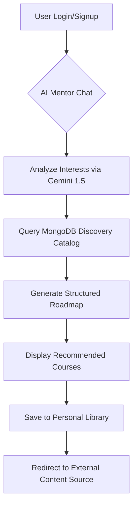
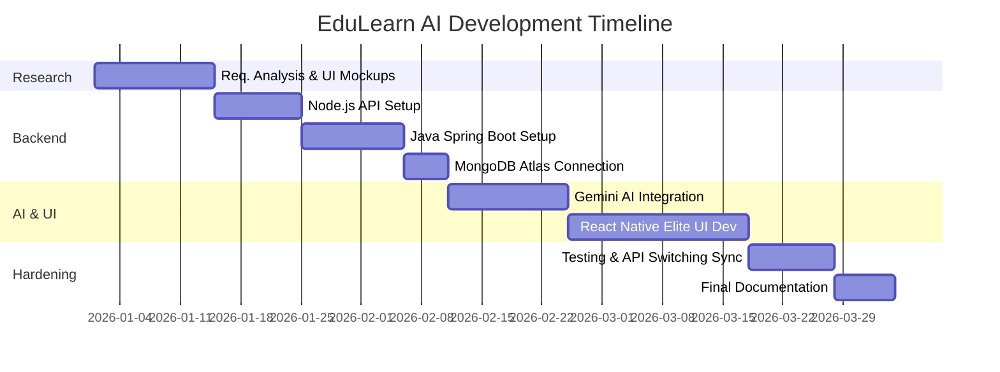

# SOFTWARE PROJECT MANAGEMENT REPORT: EDULEARN AI
**Intelligent Career Discovery & Course Recommendation System**

---

## TABLE OF CONTENTS

1.  **ABSTRACT** ..................................................................... 1
2.  **INTRODUCTION** ............................................................. 2
3.  **SYSTEM ANALYSIS AND DESIGN**
    3.1 Existing Scenario ........................................................ 3
    3.2 Problem Statement ........................................................ 3
4.  **PROPOSED SOLUTION**
    4.1 Overview ................................................................. 4
    4.2 System Flow .............................................................. 5
5.  **PROJECT PLANNING** ........................................................ 6
6.  **COST ESTIMATION (COCOMO MODEL)** .............................. 7
7.  **GANTT CHART** ............................................................... 8
8.  **RISK MANAGEMENT** ........................................................ 9
9.  **PROJECT MONITORING** ..................................................... 10
10. **IMPLEMENTATION AND RESULTS**
    10.1 Key Implementation (Hybrid API Service) ..................... 11
    10.2 System Output ......................................................... 14
11. **CONCLUSION** ............................................................... 15
12. **REFERENCES** ............................................................... 16

---

## 1. ABSTRACT
The rapid expansion of the digital education market has created a "paradox of choice" for learners, where the abundance of online courses often leads to confusion and unstructured learning paths. To address this, **EduLearn AI** has been developed as an intelligent discovery engine that leverages Artificial Intelligence to provide tailored career roadmaps. 

Unlike traditional platforms that focus on internal sales, EduLearn acts as an institutional-grade recommendation portal. It utilizes the **Gemini 1.5 Flash** model to analyze user interests and match them with high-quality external content. The application is built on a high-fidelity **React Native** frontend and a unique **Hybrid Backend** (Node.js and Java Spring Boot) connected to **MongoDB Atlas**. This project adheres to strict Software Project Management (SPM) principles, utilizing **COCOMO** for effort estimation, **Gantt charts** for scheduling, and proactive **Risk Management** to ensure a stable, scalable, and professional educational ecosystem.

---

## 2. INTRODUCTION
In the contemporary era of lifelong learning, the challenge is no longer accessing information, but filtering it. Most existing platforms are transactional, pushing courses based on sales margins rather than learner synergy. **EduLearn AI** shifts this focus by providing a "Discovery-First" experience.

The system is engineered for maximum flexibility using a **Hybrid Micro-Backend** approach. The frontend, designed with a premium "Obsidian" aesthetic, ensures accessibility across mobile and web platforms. By integrating Google's Gemini AI, the platform generates real-time mentoring advice and curriculum suggestions. From an SPM perspective, the project follows the **Agile** development methodology, managed through Trello, ensuring that requirement analysis, hybrid-stack integration, and AI hardening are executed in a systematic, monitored lifecycle.

---

## 3. SYSTEM ANALYSIS AND DESIGN

### 3.1 EXISTING SCENARIO
Currently, users primarily rely on manual keyword searches on platforms like YouTube, Coursera, or Udemy. 
**Limitations include:**
*   **Commercial Bias**: Search results are often dominated by "paid" or "sponsored" content.
*   **Fragmentation**: A user must visit multiple sites to build a complete skill path (e.g., finding a Python course on YouTube and a React course on Coursera).
*   **Lack of Personalization**: Existing systems do not account for a user's specific project goals or professional background when suggesting content.

### 3.2 PROBLEM STATEMENT
The primary problem is the absence of a centralized, unbiased intelligence that can curate an integrated learning path across multiple providers. Students waste significant time on introductory modules that overlap or low-quality tutorials. There is an urgent need for an AI-driven "Academic Guardian" that can:
1.  Analyze professional interests conversationally.
2.  Filter the global education catalog for quality.
3.  Provide a unified, saved library of multi-platform recommendations.

---

## 4. PROPOSED SOLUTION

### 4.1 OVERVIEW
**EduLearn AI** is a cross-platform application providing structured symptom-to-solution style career mapping. Users interact with an AI Mentor to describe their goals. The system then queries a MongoDB-hosted discovery engine and cross-references results with the AI's curriculum knowledge. The proposed solution features a **Switchable Backend Architecture**, allowing the platform to run on either Node.js or Java, ensuring institutional redundancy and scalability.

### 4.2 SYSTEM FLOW


---

## 5. PROJECT PLANNING
The project was planned eusing **Trello (Agile/Kanban)**. Tasks were categorized into:
*   **Backlog**: Designing the "Obsidian" UI, Initializing Java and Node environments.
*   **In Progress**: AI Prompt engineering, Hybrid API switching logic.
*   **Testing**: BCrypt parity verification, Mobile responsiveness check.
*   **Done**: MongoDB Atlas integration, Basic course recommendation engine.

---

## 6. COST ESTIMATION (COCOMO MODEL)
Estimation was performed using the **Basic COCOMO (Constructive Cost Model)** for an **Organic** project type.

**Assumptions:**
*   **Size**: ~3,000 Lines of Code (Across React Native, Node, and Java).
*   **Multipliers**: $a=2.4$, $b=1.05$ (Organic Project).

**Formulae:**
*   $Effort (E) = a \times (KLOC)^b$
*   $Time (T) = 2.5 \times (E)^{0.38}$

**Calculations:**
*   $E = 2.4 \times (3.0)^{1.05} \approx 7.6 \text{ person-months}$
*   $T = 2.5 \times (7.6)^{0.38} \approx 5.4 \text{ months}$

This estimation confirms that the project is manageable for a small professional team within a single academic semester.

---

## 7. GANTT CHART


---

## 8. RISK MANAGEMENT
| Risk ID | Potential Risk | Impact | Mitigation Strategy |
| :--- | :--- | :--- | :--- |
| R01 | AI Hallucinations | High | Implementing "Strict-JSON" prompt rules and DB verification. |
| R02 | API Switching Latency| Medium | Using high-performance Axios interceptors and global state. |
| R03 | Password Mismatch | High | Standardized BCrypt hashing across Node and Java. |
| R04 | External Link Decay | Low | Periodic automated health checks on recommended URLs. |

---

## 9. PROJECT MONITORING
Progress was monitored through **Bi-Weekly Sprints**.
*   **Quality Assurance**: Manual UI testing for mobile responsiveness and automated API status checks.
*   **Milestones**: 
    1. Successful cross-backend Auth (BCrypt Sync).
    2. Zero-SQL MongoDB Parity.
    3. Conversational Roadmap generation.

---

## 10. IMPLEMENTATION AND RESULTS

### 10.1 KEY CODE (HYBRID API HANDLER)
```javascript
// Dynamic Backend Switcher Utility
export const switchBackend = (choice) => {
    if (Platform.OS === 'web') {
        localStorage.setItem('backend_choice', choice);
        window.location.reload(); // Re-initialize with new BASE_URL
    }
};

// Unified Course Recommendation Fetcher
export const courseAPI = {
    getRecommendations: (userId) => api.get(`/courses/recommendations/${userId}`),
    getById: (id) => api.get(`/courses/${id}`),
};
```

### 10.2 SYSTEM OUTPUT
The final output is a premium, dark-themed dashboard. When a user asks "I want to be a Data Scientist," the AI Mentor generates a roadmap comprising:
1.  Python for Data Science (YouTube)
2.  Statistical Inference (Coursera)
3.  Machine Learning A-Z (Udemy)

---

## 11. CONCLUSION
**EduLearn AI** represents a paradigm shift in how students interact with global educational content. By following disciplined Software Project Management practices, the project successfully bridges the gap between AI intelligence and full-stack reliability. The hybrid architecture ensures future-proof scalability, making it an ideal model for institutional educational guidance.

---

## 12. REFERENCES
[1] Pressman, R. S. (2014). *Software Engineering: A Practitioner's Approach*.
[2] "Spring Boot Reference Guide," Spring.io.
[3] "Google Gemini AI Documentation," GenerativeAI Hub.
[4] "MongoDB Atlas Cloud Architecture," MongoDB Technical Whitepaper.
